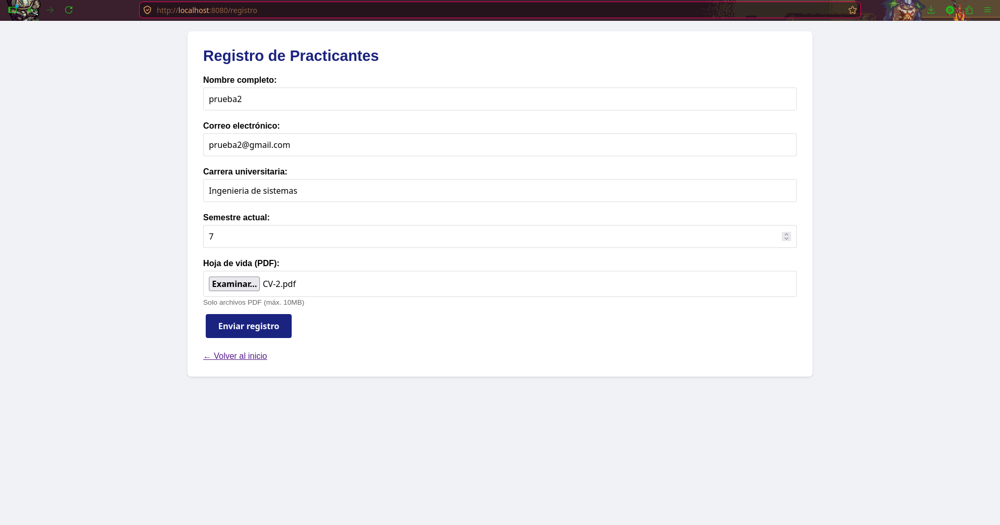
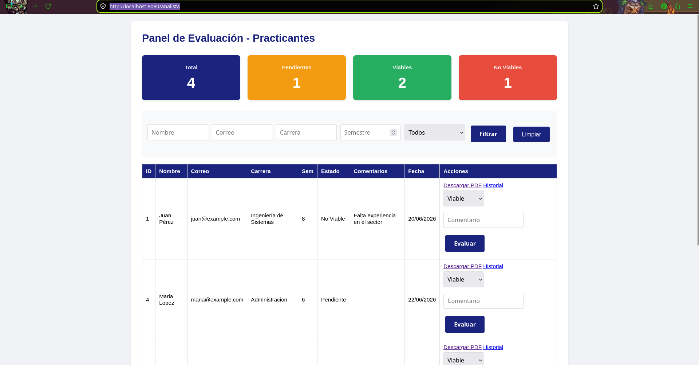

# Sistema de Registro y Evaluación de Practicantes

Aplicación web para el registro de practicantes universitarios y su evaluación por parte de analistas de selección.

## Tecnologías

- Java 25 + Spring Boot 3.4
- PostgreSQL 17
- Spring Security (autenticación)
- Thymeleaf (templates)
- HTML5 + CSS3 (responsive)
- Maven

## Estructura del Proyecto

├── src/main/java/com/banco/practicantes/
│   ├── config/          # Seguridad y configuración
│   ├── controllers/     # Controladores MVC
│   ├── models/          # Entidades JPA
│   ├── repositories/    # Interfaces JPA
│   └── services/        # Lógica de negocio
├── src/main/resources/
│   ├── static/css/      # Estilos
│   └── templates/       # Vistas Thymeleaf
└── uploads/             # Hojas de vida PDF

## Funcionalidades

### Para Practicantes
- Formulario de registro con datos personales y académicos
- Carga de hoja de vida en PDF
- Confirmación visual al enviar

### Para Analistas (requiere login)
- Dashboard con métricas: total, pendientes, viables, no viables
- Tabla con todos los candidatos registrados
- Filtros por nombre, correo, carrera, semestre y estado
- Evaluación: marcar como Viable o No Viable con observaciones
- Historial de evaluaciones: quién evaluó, cuándo y qué comentó
- Descarga de hojas de vida en PDF
- Responsive: se adapta a móviles y tablets

## Instalación

### Requisitos
- Java 21+
- PostgreSQL 17
- Maven 3.9+

### Base de datos
CREATE DATABASE practicantes_db;

### Configuración
Editar src/main/resources/application.properties:
spring.datasource.url=jdbc:postgresql://localhost:5432/practicantes_db
spring.datasource.username=TU_USUARIO
spring.datasource.password=TU_CONTRASEÑA

### Ejecutar
mvn spring-boot:run
Acceder en: http://localhost:8080

## Credenciales por defecto

| Rol      | Usuario   | Contraseña   |
|----------|-----------|--------------|
| Analista | analista  | analista123  |

## API Endpoints

| Método | Ruta | Descripción |
|--------|------|-------------|
| GET | / | Página de inicio |
| GET | /registro | Formulario de registro |
| POST | /api/practicantes | Registrar practicante |
| GET | /analista | Panel de analista (protegido) |
| POST | /api/practicantes/{id}/evaluar | Evaluar candidato |
| GET | /analista/historial/{id} | Ver historial |
| GET | /api/practicantes/{id}/pdf | Descargar hoja de vida |

## Capturas de Pantalla

### Página de Inicio

### Registro de Practicante

### Panel del Analista
